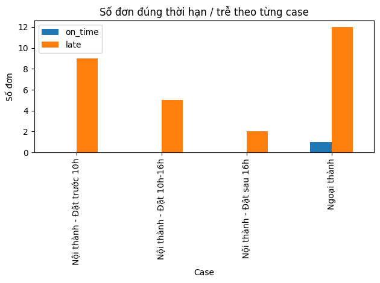
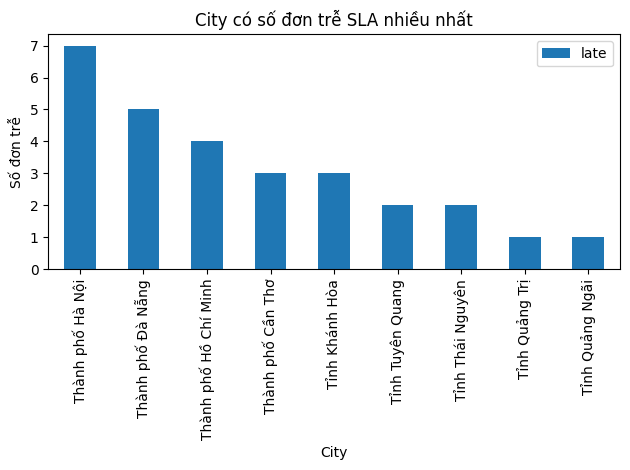
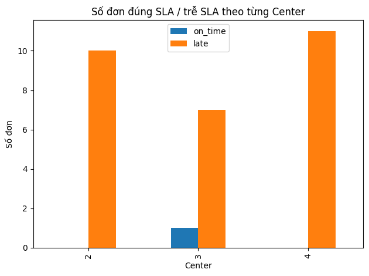

# SLA Order Analysis & Visualization

Dự án dùng để **phân tích SLA đơn hàng**, xác định **đơn đúng / trễ SLA**,  
sau đó **thống kê và trực quan hóa kết quả** theo:
- Loại đơn (nội/ngoại thành, khung giờ đặt)
- Trung tâm (Center)
- Tỉnh/Thành phố (City)

---

## 1. Dữ liệu đầu vào

File Excel: `Test.xlsx` (Sheet1)

Thứ tự 6 cột đầu:

| Cột | Ý nghĩa |
|----|-------|
| 1 | `created_at` – Thời điểm đặt đơn |
| 2 | `approved_at` – Thời điểm duyệt đơn |
| 3 | `packed_at` – Thời điểm tạo kiện |
| 4 | `completed_at` – Thời điểm giao xong |
| 5 | `city` – Tỉnh / Thành phố giao |
| 6 | `center` – Trung tâm xử lý (02, 03, 04) |

Dòng trống hoặc thiếu dữ liệu bắt buộc sẽ bị bỏ qua.

---

## 2. Ý tưởng & thuật toán

### Bước 1 – Phân loại nội / ngoại thành
- Center 04 + Hà Nội → nội thành  
- Center 02 + Hồ Chí Minh → nội thành  
- Center 03 + Đà Nẵng → nội thành  
- Các trường hợp còn lại → ngoại thành  

---

### Bước 2 – Phân loại case nội thành theo giờ đặt
| Case | Điều kiện |
|---|---|
| `inner_case1` | Đặt đơn **trước 10h** |
| `inner_case2` | Đặt đơn **từ 10h – trước 16h** |
| `inner_case3` | Đặt đơn **sau 16h** |

Ngoại thành → `outer_case`

---

### Bước 3 – Áp dụng quy tắc SLA

#### Nội thành
- **Case 1 (trước 10h)**  
  - Duyệt ≤ 12h cùng ngày  
  - Đóng kiện ≤ 14h cùng ngày  
  - Giao trong ngày  

- **Case 2 (10h–16h)**  
  - Duyệt ≤ 17h cùng ngày  
  - Đóng kiện ≤ 10h ngày hôm sau  
  - Giao ≤ 10h ngày hôm sau  

- **Case 3 (sau 16h)**  
  - Duyệt ≤ 9h30 ngày hôm sau  
  - Đóng kiện ≤ 12h ngày hôm sau  
  - Giao ≤ 16h ngày hôm sau  

#### Ngoại thành
- Duyệt trong 24h từ lúc đặt
- Đóng kiện trong 4h từ lúc duyệt
- Giao trong 24h từ lúc đóng kiện

---

### Bước 4 – Xác định SLA
- **Trễ SLA**: tất cả các mốc thời gian thỏa điều kiện

---

## 3. Kết quả thống kê

Sau khi xử lý, hệ thống sinh ra các thống kê:

### 3.1. Theo loại case
Mỗi case có: 

=== Nội thành - Đặt trước 10h ===

  Tổng đơn : 9
  Trễ SLA  : 9

=== Nội thành - Đặt 10h-16h ===

  Tổng đơn : 5
  Trễ SLA  : 5

=== Nội thành - Đặt sau 16h ===

  Tổng đơn : 2
  Trễ SLA  : 2

=== Ngoại thành ===

  Tổng đơn : 13
  Trễ SLA  : 12

---

### 3.2. Theo Center & City
Thống kê cho từng cặp `(Center, City)`:

=== THỐNG KÊ THEO CENTER & CITY ===

- Center 4 - Thành phố Hà Nội: Tổng 7 đơn, Trễ SLA 7 đơn
- Center 4 - Tỉnh Tuyên Quang: Tổng 2 đơn, Trễ SLA 2 đơn
- Center 4 - Tỉnh Thái Nguyên: Tổng 2 đơn, Trễ SLA 2 đơn
- Center 3 - Thành phố Đà Nẵng: Tổng 5 đơn, Trễ SLA 5 đơn
- Center 3 - Tỉnh Quảng Ngãi: Tổng 2 đơn, Trễ SLA 1 đơn
- Center 3 - Tỉnh Quảng Trị: Tổng 1 đơn, Trễ SLA 1 đơn
- Center 2 - Thành phố Cần Thơ: Tổng 3 đơn, Trễ SLA 3 đơn
- Center 2 - Tỉnh Khánh Hòa: Tổng 3 đơn, Trễ SLA 3 đơn

---

## 4. DataFrame & Chart

### DataFrame được sinh
| DataFrame | Nội dung |
|---|---|
| `df_case` | Thống kê theo case SLA |
| `df_center_city` | Thống kê theo Center & City |
| `df_center` | Tổng hợp theo Center |

---

### Chart được vẽ

#### Chart 1 – SLA theo case

**Bar chart (on-time vs late)**  
- So sánh 3 khung nội thành và ngoại thành
- Dùng để xác định **case rủi ro SLA cao nhất**

**Insight**  
Rủi ro ở Ngoại thành: Mặc dù số đơn ngoại thành cao nhất (cho thấy nhu cầu lớn), nhưng việc xuất hiện đơn on_time (dù chỉ 1 đơn) cho thấy khâu vận chuyển đi xa hoặc logistics ngoại thành đang gặp ít vấn đề hoặc rủi ro hơn so với nội thành

---

#### Chart 2 – SLA theo Center

**Bar chart (on-time vs late)**  

---

#### Chart 3 – Top City trễ SLA

---
